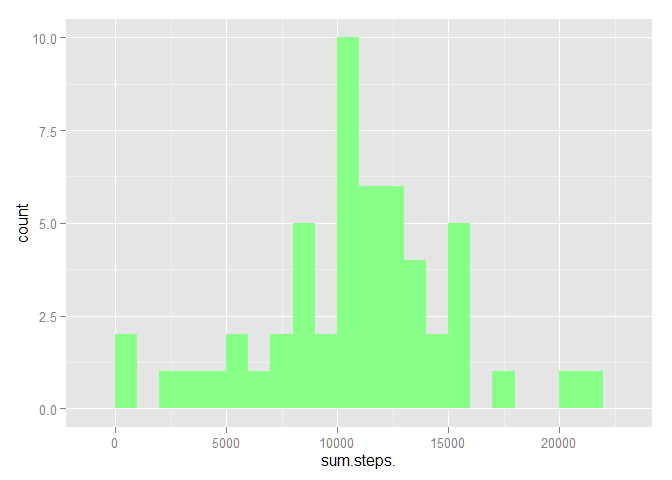
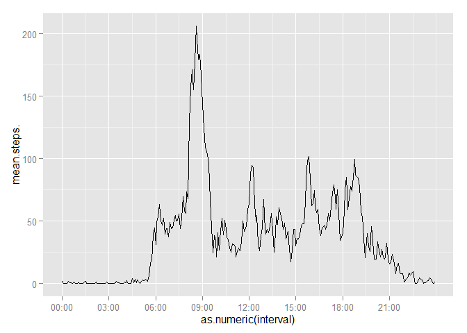
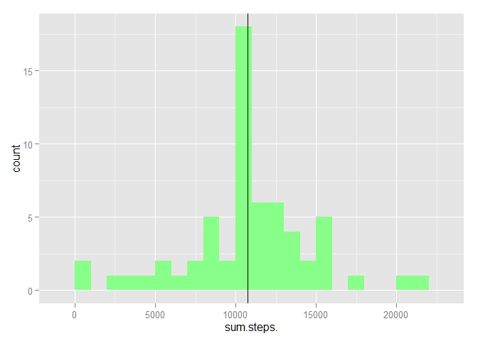
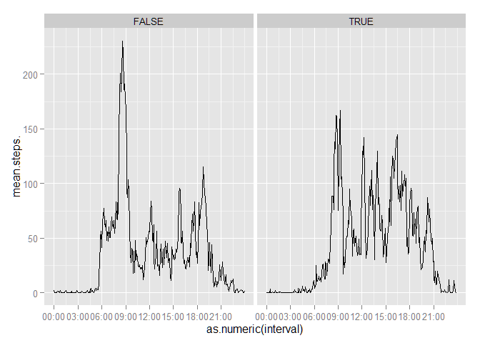

# Reproducible Research: Peer Assessment 1

## Loading and preprocessing the data

```r
    require(dplyr)
    require(ggplot2)

    # setwd("YOUR_WD_HERE")
    dat <- read.csv(unzip("activity.zip"),stringsAsFactors=FALSE)
    dat$date <- as.Date(dat$date)
    dat$interval <- paste0(formatC(dat$interval, width = 4
        , format = "d", flag = "0"))
    dat$interval <- sub("([0-9]{2,2})", "\\1:\\2", dat$interval)
    dat$interval <- as.factor(dat$interval)
```

## What is mean total number of steps taken per day?
For this part of the assignment, you can ignore the missing values in
the dataset.

1. Make a histogram of the total number of steps taken each day

```r
    hist_dat <- dat %>% group_by(date) %>% summarize(sum(steps))
    names(hist_dat) <- make.names(names(hist_dat))
    hist_plot <- ggplot(hist_dat)
    hist_plot <- hist_plot + geom_histogram(aes(x=sum.steps.)
        ,binwidth=1000,fill="#88FF88")
    hist_plot
```

 

2. Calculate and report the **mean** and **median** total number
of steps taken per day

```r
    step_mean <- mean(hist_dat$sum.steps.,na.rm=TRUE)
    step_median <- median(hist_dat$sum.steps.,na.rm=TRUE)
    hist_plot + geom_vline(xintercept=step_mean)
```

 

The mean number of steps is 10766 and the median
number of steps is 10765.


## What is the average daily activity pattern?
1. Make a time series plot (i.e. `type = "l"`) of the 5-minute interval (x-axis)
and the average number of steps taken, averaged across all days (y-axis)

```r
    pat_dat <- dat %>% group_by(interval) %>% summarize(mean(steps,na.rm=TRUE))
    names(pat_dat) <- c("interval","mean.steps.")
    
    br <- 36
    pat_breaks <- seq(1,length(pat_dat$interval),br)
    pat_intervals <- pat_dat$interval[seq(1, length(pat_dat$interval), br)]
    
    pat_plot <- ggplot(pat_dat,aes(x=as.numeric(interval),y=mean.steps.))
    pat_plot + geom_line() + scale_x_continuous(breaks=pat_breaks,labels=pat_intervals)
```

 

2. Which 5-minute interval, on average across all the days in the dataset,
contains the maximum number of steps?

```r
    max_row <- pat_dat[which.max(pat_dat$mean.steps.),]
```

The interval 08:35 has the highest mean steps per interval,
at 206.

## Imputing missing values
Note that there are a number of days/intervals where there are missing
values (coded as `NA`). The presence of missing days may introduce
bias into some calculations or summaries of the data.

1. Calculate and report the total number of missing values in the dataset
(i.e. the total number of rows with `NA`s)

```r
    num_na <- sum(is.na(dat))
```

There are 2304 NA values in the dataset.

2. Devise a strategy for filling in all of the missing values in the dataset.
The strategy does not need to be sophisticated. For example, you could use the
mean/median for that day, or the mean for that 5-minute interval, etc.

3. Create a new dataset that is equal to the original dataset but with the
missing data filled in.

```r
    # It makes sense to me to use the mean from the time interval,
    # which has conveniently already been calculated!
    
    i_dat <- dat
    for (i in 1:nrow(i_dat)) {
        if (is.na(i_dat[i,1])) {
            i_dat[i,1] <- pat_dat[pat_dat$interval==i_dat$interval[i],2][[1]]
        }
    }
```

4. Make a histogram of the total number of steps taken each day and Calculate
and report the **mean** and **median** total number of steps taken per day. Do
these values differ from the estimates from the first part of the assignment?
What is the impact of imputing missing data on the estimates of the total daily
number of steps?

```r
    i_hist_dat <- i_dat %>% group_by(date) %>% summarize(sum(steps))
    names(i_hist_dat) <- make.names(names(i_hist_dat))
    i_hist_plot <- ggplot(i_hist_dat)
    i_hist_plot <- i_hist_plot + geom_histogram(aes(x=sum.steps.)
        ,binwidth=1000,fill="#88FF88")

    i_step_mean <- mean(i_hist_dat$sum.steps.)
    i_step_median <- median(i_hist_dat$sum.steps.)
    i_hist_plot + geom_vline(xintercept=i_step_mean)
```

 

With interpolated data added, the mean number of steps is
10766 and the median number of steps
is 10766. The effect of adding the interpolated data
was inmaterial.

## Are there differences in activity patterns between weekdays and weekends?
For this part the `weekdays()` function may be of some help here. Use the
dataset with the filled-in missing values for this part.

1. Create a new factor variable in the dataset with two levels -- "weekday"
and "weekend" indicating whether a given date is a weekday or weekend day.

```r
    weekends <- c("Saturday","Sunday")
    i_dat$is.weekend <- as.factor(weekdays(i_dat$date) %in% weekends)
```

1. Make a panel plot containing a time series plot (i.e. `type = "l"`) of
the 5-minute interval (x-axis) and the average number of steps taken, averaged
across all weekday days or weekend days (y-axis).

```r
    i_pat_dat <- i_dat %>% group_by(interval,is.weekend) %>% summarize(mean(steps,na.rm=TRUE))
    names(i_pat_dat) <- c("interval","is.weekend","mean.steps.")
    
    i_pat_plot <- ggplot(i_pat_dat,aes(x=as.numeric(interval),y=mean.steps.)) + facet_grid(. ~ is.weekend)
    i_pat_plot + geom_line() + scale_x_continuous(breaks=pat_breaks,labels=pat_intervals)
```

 

Looking at these plots, it's clear that during the week, walking is more concentrated around the
8-9 AM range. By contrast, on the weekends, steps taken are spread more evenly throughout the typical
waking hours of the day.
